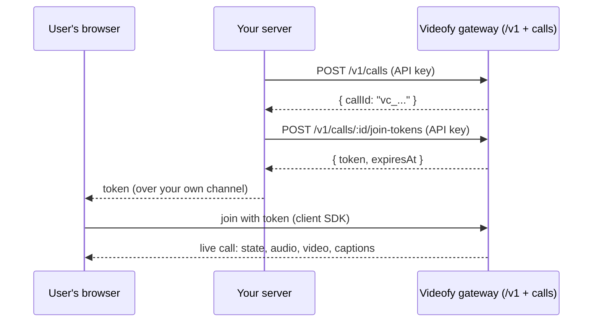

# Videofy Connect — Developer Documentation

Videofy Connect puts **live translated calls** into your own product. Your
users speak their own languages; each listener hears the others in the
language they chose, with live captions and a downloadable transcript. Video
between participants is carried by the service too — the API does not expose
or depend on any particular transport topology.

You integrate two small pieces:

| Piece | Package | Runs | Talks to |
| --- | --- | --- | --- |
| Server SDK | [`@videofy/server-sdk`](../../packages/connect-server-sdk/README.md) | your backend (Node 18+) | the Connect REST API (`/v1`) with your project API key |
## Platform architecture

```text
                         VIDEOFY CONNECT
                               │
                    Translation / Session Core
                               │
          ┌────────────────────┼────────────────────┐
          │                    │                    │
          ▼                    ▼                    ▼
   WebRTC Adapter         Platform Adapters     Telecom Adapter
      P6.5 CURRENT            P6.7+                 P6.8+
          │                    │                    │
   Browser / Web          Zoom / etc.            SIP / RTP
                                                    │
                                            ┌───────┼────────┐
                                            │       │        │
                                           PBX     PSTN      GSM
                                                             │
                                                          Carriers
```

Locked positioning (frozen with the P6.5 public contract):

- **Videofy Connect is the platform integration layer** — the `/v1` control
  plane, project credentials, join tokens, and the translation/session core.
- **`@videofy/connect` is the current browser/WebRTC client adapter**, not the
  whole platform.
- **Platform adapters such as Zoom attach server-side** (P6.7+).
- **Telecom integration begins at SIP/RTP** (P6.8+); PBX, PSTN, GSM and
  carrier integration sit beyond the SIP/RTP adapter — P6.8 introduces
  SIP/RTP, not direct GSM radio integration.
- **Current P6.5 media transport is browser/WebRTC only.**
- **The public `/v1` control-plane contracts remain transport-neutral.**
- **P2P video is current implementation only**; SFU remains the future
  scalable video path.

## Videofy Connect is the platform, not the browser SDK

**Videofy Connect** is Videofy's integration layer: the `/v1` control plane,
project credentials, join tokens, and the session/translation engine behind
them. **`@videofy/connect`** is its *browser/WebRTC client* — the first
transport, not the definition. Future adapters (conferencing platforms such as
Zoom, and SIP/RTP for telephony) attach **server-side** through the same
control plane, sessions, and translation planning, with no browser involved.

Two honest boundaries of the current release:

- **Media transport today is browser/WebRTC only.** Calls, tokens, state, and
  translation planning are transport-neutral, but the only way audio currently
  reaches the engine is a browser joining through `@videofy/connect`.
- **The client state model** (`CallSnapshot`, events, `audioOutput`
  capability) describes what a *client session* sees. Server integrations
  need none of it — the `/v1` API and `@videofy/server-sdk` are the complete
  server surface.

| Client SDK | [`@videofy/connect`](../../packages/connect-sdk/README.md) | your users' browsers | the Videofy gateway, with a single-use join token |

## How a call happens



1. Your server **creates a call** and gets back a public call id (`vc_...`).
2. For each person, your server **mints a join token** — a short-lived,
   single-use credential naming who they are and which languages they speak
   and hear.
3. Your web page hands the token to the **client SDK**, which joins the call
   and gives you a live snapshot, events, audio and video.

Two credentials, two worlds: the **API key** (`vfk_...`) belongs to your
server and never reaches a browser; the **join token** belongs to one person,
for one call, once. See [Authentication & security](auth-security.md).

## Documentation map

| Page | What it covers |
| --- | --- |
| [Quickstart](quickstart.md) | End to end: provision a project → secrets → create a call → mint a token → join from a browser → hear the translation |
| [Example: personal call, normal mode](examples-personal-normal.md) | A plain 1:1 call with no translation |
| [Example: personal call, translated](examples-personal-translated.md) | 1:1 across languages: audio modes, live language change, captions, transcript |
| [Example: conference, translated](examples-conference-translated.md) | Up to four people, mixed languages, roster, server-side mode change |
| [Authentication & security](auth-security.md) | The two authorities, key handling, the join-token lifecycle, origin policy, the one-connected-subject rule |
| [Lifecycle & reconnection](lifecycle-reconnect.md) | Connection states, suspend/resume, `needsNewJoinToken`, `enableAudio` |
| [Capabilities](capabilities.md) | `GET /v1/capabilities`, the audio-output capability, graceful degradation |
| [Errors](errors.md) | All 24 error codes, classified, with what to do for each |
| [Limits, rate limits & idempotency](limits.md) | Call sizes, token TTL bounds, the rate-limit bucket, `Idempotency-Key` |
| [OpenAPI](openapi.md) | The machine-readable API description ([openapi.json](openapi.json)) |

## Scale and semantics, stated honestly

Connect is currently at **development-demo scale**:

- **Personal calls hold 2 participants; conferences hold 4.** A fifth join
  is refused (`CALL_FULL`), never queued.
- **Languages today: `en`, `es`, `fr`.** Read the live set from
  [`GET /v1/capabilities`](capabilities.md) rather than hard-coding it.
- **Calls and join tokens live in gateway memory.** A gateway restart voids
  live calls and every outstanding token — there is no pretend persistence.
  Clients report [`needsNewJoinToken`](lifecycle-reconnect.md); servers see
  `CALL_NOT_FOUND`. Recover by creating a fresh call and minting fresh tokens.
- **`personalVoice` is reserved and unavailable** (`false` in capabilities).
  Ignore it until it turns true in a future release.
