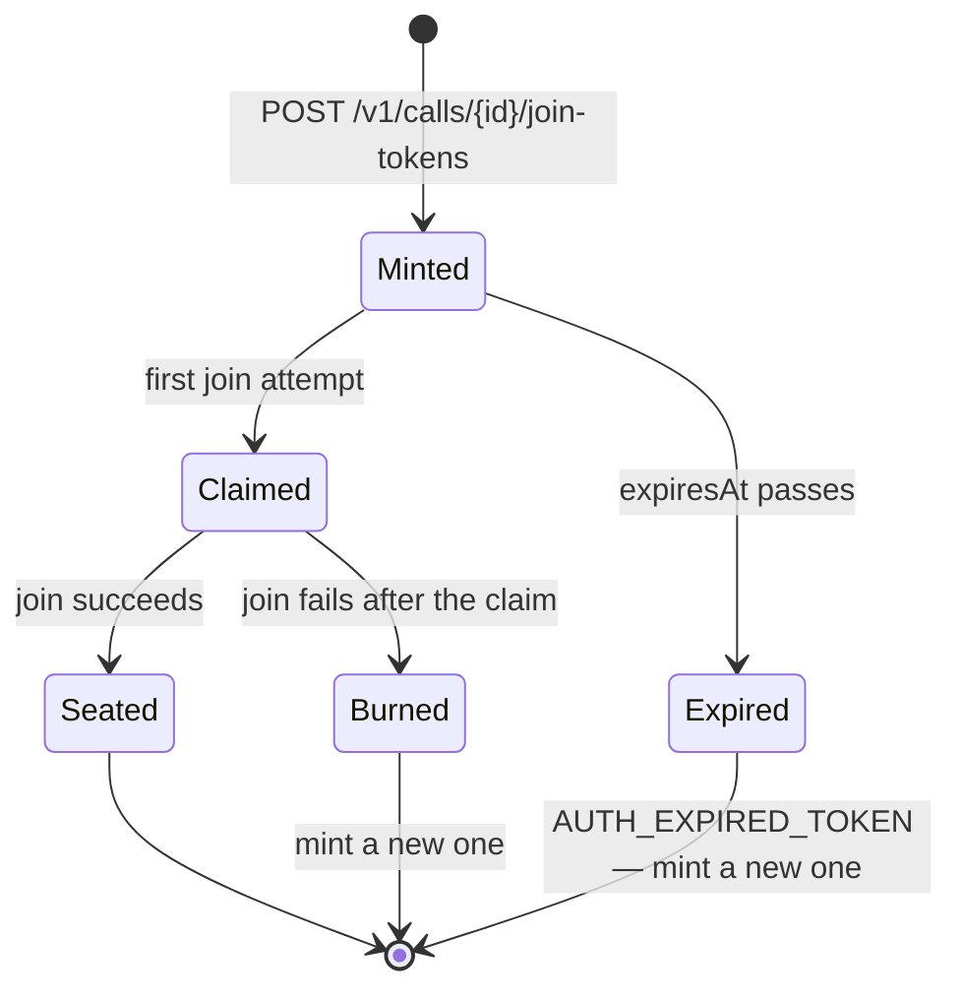

# Authentication & security

Connect draws one hard line: **your server holds authority over calls; a
browser holds authority over exactly one seat, once.** Every rule on this
page serves that line.

## The two authorities

| | Project authority | Participant |
| --- | --- | --- |
| Credential | API key (`vfk_...`) | Join token |
| Where it lives | Your server's environment | One user's browser, briefly |
| What it can do | Create calls, mint join tokens, read state, change mode, end calls | Join one named call as one named person, once |
| Lifetime | Until deactivated | Minutes (max 15), and spent on first use |
| Transport | `Authorization: Bearer vfk_...` on `/v1` requests | Handed to the client SDK unmodified |

The two never mix: an API key cannot join a call, and a join token cannot
call `/v1`. Compromise of a single token exposes one seat in one call for a
few minutes — that asymmetry is the design.

## API key handling rules

- **Server-side only.** The key must never appear in a browser bundle,
  a mobile app, client-side config, or a URL. If a key has been exposed,
  treat it as burned: provision a new project and deactivate the old one.
- **Stored as a hash.** The gateway keeps only a sha256 hash; the raw key is
  printed exactly once at provisioning and cannot be recovered. Lose it and
  you provision again.
- **Environment, not code.** Read it from an environment variable or a
  secret store; keep it out of version control.
- **Never logged.** Videofy never logs it, and `@videofy/server-sdk` redacts
  it from every error it throws — even if a misbehaving server echoes it
  back. Extend the same courtesy in your own logging.
- A deactivated project's key answers `403 FORBIDDEN_PROJECT` everywhere.

## The join-token lifecycle

A join token is a signed, opaque, single-use credential your server mints
for one person and one call. Hold it, do not parse it — its contents are not
a contract.

- **TTL:** default 300 seconds, hard maximum 900. Out-of-range requests are
  refused, never clamped. Mint close to the moment of joining.
- **Single use, first claim wins.** The claim is atomic: of two simultaneous
  joins with the same token, exactly one proceeds; the other is refused with
  `AUTH_TOKEN_USED`. A token can never admit two people.
- **Burned on later failure.** If a claimed join fails further down the
  ladder — wrong origin, call full, name taken — the token stays spent.
  Recovery is always the same cheap move: **mint a fresh token** (one
  `joinTokens.create` call) and try again. Never build retry logic around
  reusing a token.
- **Voided by restart.** Tokens (and calls) live in gateway memory; a
  restart voids every outstanding token. See
  [Lifecycle & reconnection](lifecycle-reconnect.md).

Deliver tokens to the browser over your own authenticated channel (the same
session that told you who the user is). The token inherits whatever trust
that channel has.

## Origin policy — authorization, not decoration

Each project registers an exact list of `allowedOrigins` at provisioning.
When a browser joins, the gateway verifies the token **and then** checks the
connection's `Origin` against the token's project:

- Origin not on the project's list → refused, `FORBIDDEN_ORIGIN` (and the
  claimed token is burned).
- No `Origin` at all (scripts, native shells) → refused unless the project
  was provisioned with `--allow-originless` (off by default).
- **No wildcards.** `https://*.example.com` is not accepted at provisioning.

This is an authorization check on the join itself, not CORS courtesy: a
token exfiltrated to another site fails there even though it is genuine.
Register every origin you serve from (`https://app.example.com` and
`https://www.example.com` are different origins), including your dev origin
(for example `http://localhost:5173`) in development projects.

## Subjects and participants

Two identities appear on every participant, on purpose:

- **`subject`** — yours. A stable, opaque string (1–128 characters) you put
  into the token: your user id, your CRM key. Videofy never interprets it,
  only carries it, so you can correlate call state with your own records.
- **`participantId`** — Videofy's, minted per participation. It survives an
  in-call recovery; a fresh join after leaving may mint a new one under the
  same subject. Use it for UI concerns (video tiles, caption attribution).

**One connected subject per call.** A join whose `subject` already has a
connected seat is refused with `SUBJECT_ALREADY_ACTIVE` — one person cannot
hold two live seats in the same call. A seat that has *dropped* and is
within its recovery window does not block: the same person can come back
with a fresh token while the old seat expires naturally (though it still
occupies a seat until it does — a full room may briefly answer `CALL_FULL`).

## What the platform never does

- Never logs or persists raw API keys or join tokens.
- Never interprets `subject`.
- Never exposes internal identifiers: the `vc_...` call id is the only call
  identity that exists for you, in requests, responses, and SDK state.
