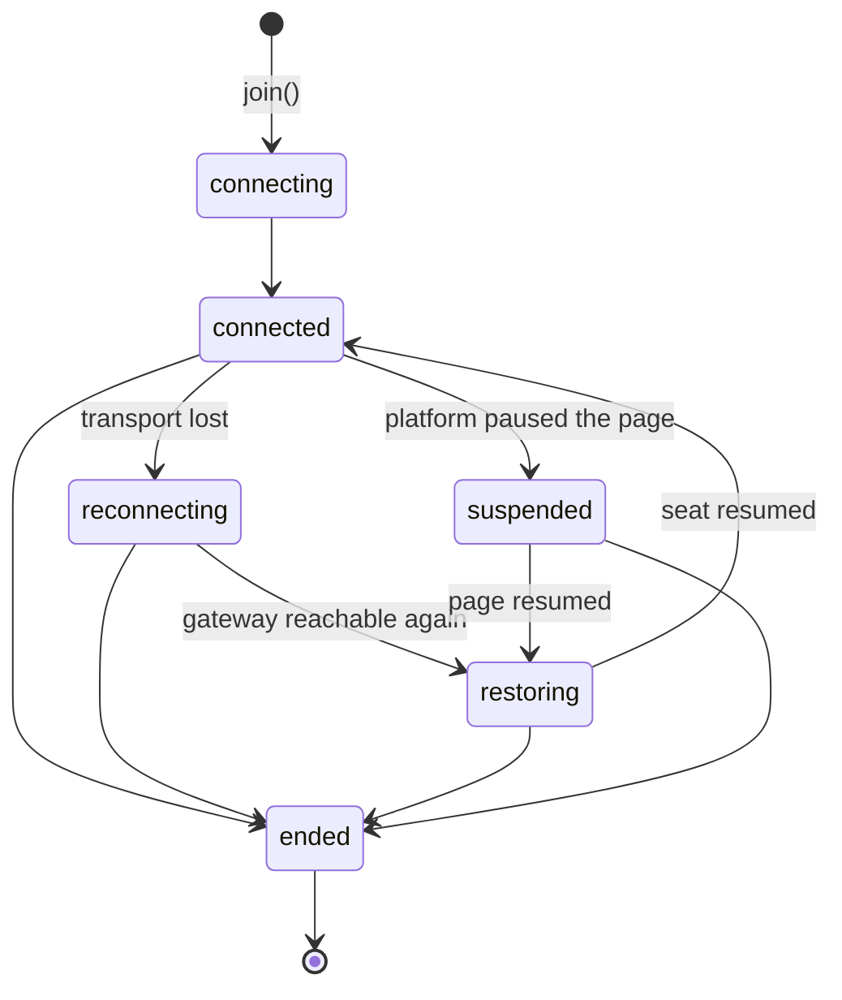

# Lifecycle & reconnection

`@videofy/connect` treats a dropped network, a backgrounded tab, and a
pocketed phone as normal weather, not exceptions. This page explains the
connection states you will observe, what the SDK does on its own, and the
two moments that need code from you: `audioBlocked` and `needsNewJoinToken`.

## Connection states

`snapshot.connection` holds one of six states; `connectionChanged` fires on
every transition (and, like all events, a fresh `state` snapshot accompanies
it).



| State | Meaning | Your UI |
| --- | --- | --- |
| `connecting` | First join in progress | Spinner |
| `connected` | Live: audio, video, captions flowing | The call |
| `reconnecting` | Transport lost; the SDK is trying to reach the gateway | "Reconnecting…" — do not tear down |
| `restoring` | Gateway reached; the same seat is being resumed | Same as above |
| `suspended` | The platform paused the page (hidden tab, locked phone) | Nothing — recovery starts on resume |
| `ended` | Final: left, ended by your server, ended by the call, or unrecoverable | Leave the call UI |

## What the SDK does by itself

- **Resumes the same seat.** Across a drop or a page reload (same origin and
  tab), the SDK re-takes the seat it held — same `participantId`, no new
  token needed — retrying on a short timer until it succeeds or learns it
  cannot. Other participants see the seat as `connected: false` in the
  interim rather than gone.
- **Keeps trying while there is hope.** Transient refusals keep the retry
  loop alive; only a terminal answer produces `needsNewJoinToken`.
- **Recovers from suspension.** When the platform resumes the page, the SDK
  walks `restoring` back to `connected` unprompted.

The recovery window is bounded: a seat that stays disconnected too long is
reclaimed by the call, after which resumption is impossible.

## `needsNewJoinToken` — the one terminal signal

When resuming can no longer work, the SDK stops pretending and emits
`needsNewJoinToken`, then ends the call object. It means one thing: **the
credential and seat in hand are finished** — the gateway restarted, the seat
was reclaimed, or the participation is no longer recognized. No retry with
the old token can ever succeed.

Recovery is your server's cheap favor:

```js
call.on('needsNewJoinToken', async () => {
  const { token } = await fetchFreshTokenFromYourServer();   // one mint call
  currentCall = await client.join({ token });
  wireUp(currentCall);   // event listeners bind to the NEW call object
});
```

The rejoin may mint a fresh `participantId`; the person's `subject` is
unchanged, so your own bookkeeping carries straight across.

**Restart semantics, plainly:** calls and join tokens live in gateway
memory. A gateway restart voids all of them — browsers get
`needsNewJoinToken`; your server sees `CALL_NOT_FOUND` for the old call and
should create a fresh one and mint fresh tokens.

## `audioBlocked` and `enableAudio()`

Browsers refuse to play audio before the user has interacted with the page.
When playback is blocked the SDK emits `audioBlocked`; show a button and
call `enableAudio()` from inside the click:

```js
call.on('audioBlocked', () => {
  unmuteButton.hidden = false;
  unmuteButton.onclick = async () => {
    await call.enableAudio();
    unmuteButton.hidden = true;
  };
});
```

One gesture unlocks **both** playback families — translated voices and the
other participants' original voices (they are separate media elements with
separate autoplay permissions). The event is edge-triggered: it fires when
blocking is discovered, not continuously.

## Leaving vs disposing

| | `leave()` | `dispose()` |
| --- | --- | --- |
| Tells the call you are gone | Yes — the seat is surrendered | No |
| Releases mic/camera/audio | Yes | Yes |
| Stored resume credentials | Cleared | Kept |
| After it | Rejoining needs a new token | The seat can still be resumed within the recovery window |

Use `leave()` for the hang-up button. Use `dispose()` for teardown that is
not a goodbye — component unmount in a SPA route change, for example — when
a reload should still be able to resume the seat. `dispose()` is idempotent
and emits nothing.

## Ended is ended

Whether the user left, your server called
[`calls.end`](examples-conference-translated.md#server-side-control), or the
call ended on its own, the call object reaches `ended` and stays there:
methods reject with `CALL_ENDED`, and no further events follow. Join again
with a fresh token and a fresh `VideofyCall` object.
